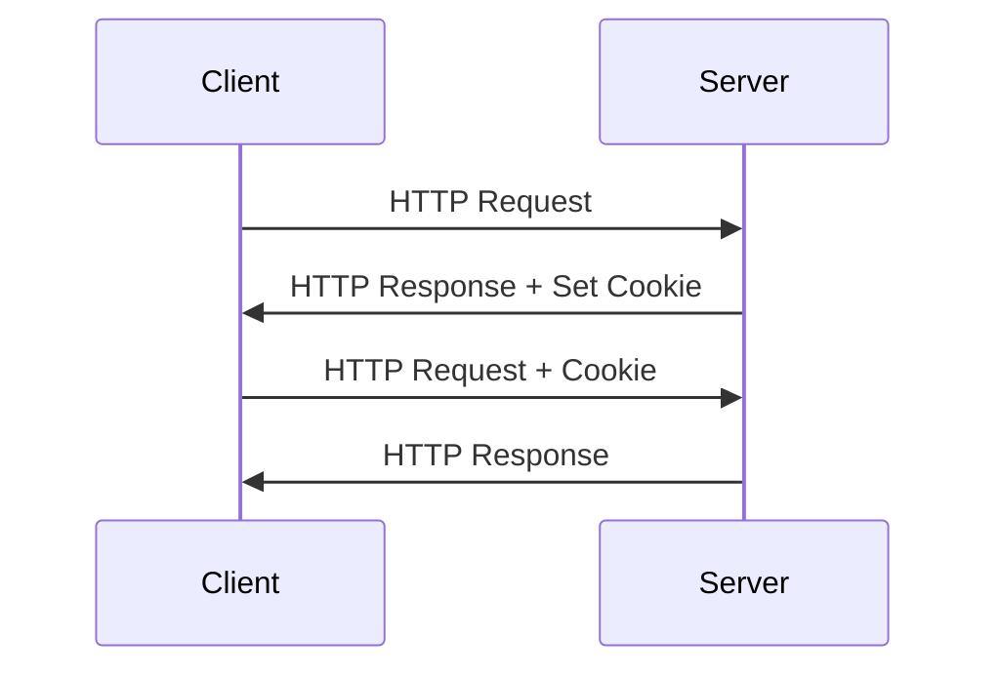

## 跨域问题

## cookie-session 技术 token

- Cookie是客户端保持HTTP会话状态的技术，
- Session是服务端保持HTTP会话状态的技术

- [一文带你彻底搞懂Cookie、Session和Token - 大数据从业者FelixZh - 博客园](https://www.cnblogs.com/felixzh/p/16883998.html)

## 注解 ModelAttribute

- [从原理层面掌握@ModelAttribute 的使用（核心原理篇）【一起学 Spring MVC】 - YourBatman - 博客园](https://www.cnblogs.com/yourbatman/p/11361070.html)
- [Spring Boot 注解学习之@ServletComponentScan 及扩展@ServletComponentSca - 掘金](https://juejin.cn/post/6844904019391938574)
- [Servlet 表单数据 | 菜鸟教程](https://www.runoob.com/servlet/servlet-form-data.html)
- [Web 基础 - Java 教程 - 廖雪峰的官方网站](https://liaoxuefeng.com/books/java/web/basic/index.html)
- [@ModelAttribute :: Spring Framework](https://docs.spring.io/spring-framework/reference/web/webmvc/mvc-controller/ann-methods/modelattrib-method-args.html)

## 参考资料

- [如何对 Spring MVC 中的 Controller 进行单元测试 - nuccch - 博客园](https://www.cnblogs.com/nuccch/p/15901976.html)
- [Spring Boot — 使用 MockMvc 測試 Controller | by Vivi Wang | Medium](https://vivifish.medium.com/spring-boot-%E4%BD%BF%E7%94%A8-mockmvc-%E6%B8%AC%E8%A9%A6-controller-b9486c2ac1e6)
- [SpringBoot 基础之 MockMvc 单元测试\_springboot test mockmvc-CSDN 博客](https://blog.csdn.net/wo541075754/article/details/88983708)
